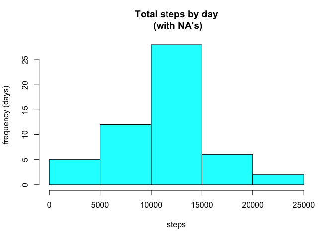

# Reproducible Research: Peer Assessment 1


## Loading and preprocessing the data

The file used in this assignment can be found in the address https://d396qusza40orc.cloudfront.net/repdata/data/activity.zip.

It is **important** to set the working directory to the directory were the file will be downloaded as it
is assumed **no particular directory will be created**.

First, let's download, extract and load its contents to a data.frame named **cpActty**:

**Step 1** - Download the file:


```r
if(!file.exists("activity.csv")) {
temp<-tempfile()
download.file("https://d396qusza40orc.cloudfront.net/repdata/data/activity.zip", temp, method="curl")}
```

**Step 2** - Extract the file:


```r
if(!file.exists("activity.csv")) {
unzip(temp)
unlink(temp)}
```

**Step 3** - Load its contents to a data.frame named cpActty and overview its contents:


```r
cpActty <- read.csv("activity.csv", colClasses = c("numeric", "character", "numeric"))
head(cpActty)
```

```
##   steps       date interval
## 1    NA 2012-10-01        0
## 2    NA 2012-10-01        5
## 3    NA 2012-10-01       10
## 4    NA 2012-10-01       15
## 5    NA 2012-10-01       20
## 6    NA 2012-10-01       25
```

**Note:** In **Step 1** and **Step 2**, before downloading and extracting, we check if the **activity.csv** already exists. It's not necessary to download and extract it every time we run the code.

## What is mean total number of steps taken per day?

In order to obtain the average steps taken per day, first we will aggregate days and steps in a new
data.frame. In this particular, let's call it **cpTtlstepsday**.


```r
cpTtlstepsday<-aggregate(steps ~ date, data = cpActty, sum, na.rm = TRUE)
```

Now, let's see its contents:


```r
head(cpTtlstepsday)
```

```
##         date steps
## 1 2012-10-02   126
## 2 2012-10-03 11352
## 3 2012-10-04 12116
## 4 2012-10-05 13294
## 5 2012-10-06 15420
## 6 2012-10-07 11015
```

As required, below we plot a **histogram** of the total number of steps taken each day:


```r
hist(cpTtlstepsday$steps, main = "Total steps by day\n (with NA's)", xlab = "steps", ylab ="frequency (days)", col = "cyan")
```

 

And, finally, the mean and the median:


```r
mean(cpTtlstepsday$steps, na.rm=TRUE)
```

```
## [1] 10766.19
```

```r
median(cpTtlstepsday$steps, na.rm=TRUE)
```

```
## [1] 10765
```


As the functions above show, the mean is **10766** and the median is **10765**.

## What is the average daily activity pattern?


## Imputing missing values


## Are there differences in activity patterns between weekdays and weekends?
