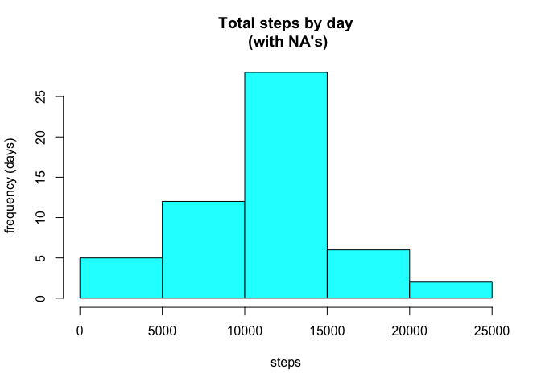
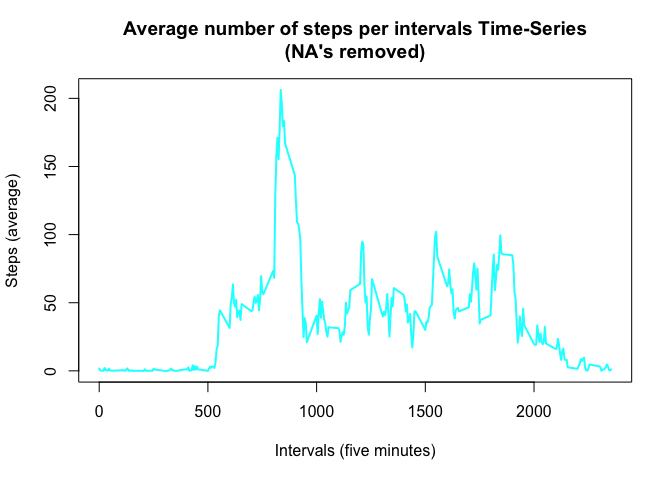
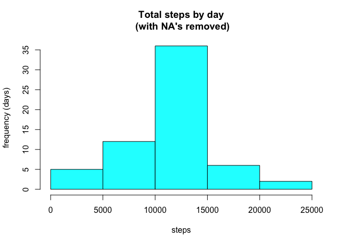
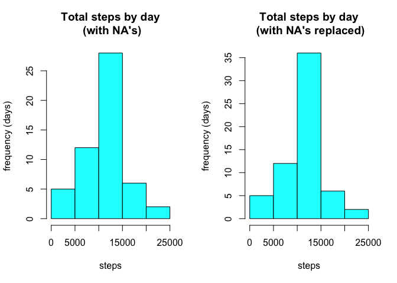
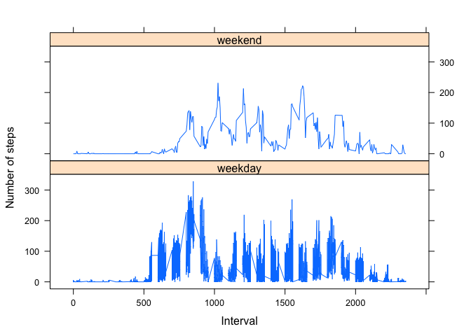

# Reproducible Research: Peer Assessment 1
Franklin Siqueira  
09/2015  
***
## Contents

### 1. Loading and preprocessing the data

### 2. What is mean total number of steps taken per day?

### 3. What is the average daily activity pattern?

### 4. Inputing missing values

### 5. Are there differences in activity patterns between weekdays and weekends?

### Acknowledgements
***

## 1. Loading and preprocessing the data

The file used in this assignment can be found in the address https://d396qusza40orc.cloudfront.net/repdata/data/activity.zip.

It is **important** to set the working directory to the directory were the file will be downloaded as it
is assumed **no particular directory will be created**.

1.1 First, let's download, extract and load its contents to a data.frame named **cpActty**:

**Step 1** - Download the file:


```r
if(!file.exists("activity.csv")) {
temp <- tempfile()
download.file("https://d396qusza40orc.cloudfront.net/repdata/data/activity.zip", temp, method="curl")}
```

**Step 2** - Extract the file:


```r
if(!file.exists("activity.csv")) {
unzip(temp)
unlink(temp)}
```

**Step 3** - Load its contents to a data.frame named cpActty and overview its contents:


```r
cpActty <- read.csv("activity.csv", colClasses = c("numeric", "character", "numeric"), stringsAsFactors=FALSE)
head(cpActty)
```

```
##   steps       date interval
## 1    NA 2012-10-01        0
## 2    NA 2012-10-01        5
## 3    NA 2012-10-01       10
## 4    NA 2012-10-01       15
## 5    NA 2012-10-01       20
## 6    NA 2012-10-01       25
```

**Note:** In **Step 1** and **Step 2**, before downloading and extracting, we check if the **activity.csv** already exists. It's not necessary to download and extract it every time we run the code.

***

## 2. What is mean total number of steps taken per day?

2.1 In order to obtain the average steps taken per day, first we will aggregate days and steps in a new
data.frame. In this particular, let's call it **cpTtlstepsday**.


```r
cpTtlstepsday <- aggregate(steps ~ date, data = cpActty, sum, na.rm = FALSE)
```

2.1.1 Now, let's see its contents:


```r
head(cpTtlstepsday)
```

```
##         date steps
## 1 2012-10-02   126
## 2 2012-10-03 11352
## 3 2012-10-04 12116
## 4 2012-10-05 13294
## 5 2012-10-06 15420
## 6 2012-10-07 11015
```

2.2 As required, below we plot a **histogram** of the total number of steps taken each day:


```r
hist(cpTtlstepsday$steps, main = "Total steps by day\n (with NA's)", xlab = "steps", ylab ="frequency (days)", col = "cyan")
```

 

2.3 And, the mean, the median and maximum (per day) and the total:


```r
mean(cpTtlstepsday$steps, na.rm=FALSE)
```

```
## [1] 10766.19
```

```r
median(cpTtlstepsday$steps, na.rm=FALSE)
```

```
## [1] 10765
```

```r
max(cpTtlstepsday$steps, na.rm=FALSE)
```

```
## [1] 21194
```

```r
sum(cpTtlstepsday$steps, na.rm=FALSE)
```

```
## [1] 570608
```

As calculations above show, the mean is **10766**, the median is **10765** and the maximum is **21194**.

***

## 3. What is the average daily activity pattern?

3.1 Previously, we aggregated the data in terms of steps/date in order to obtain the total steps taken per day and saved it in data.frame called it **cpTtlstepsday**. Now, we are aggregating the data in terms of steps/intervals and saving it in a data.frame called **cpMeanstepsintervals**, as shown in the piece of code below:


```r
cpMeanstepsintervals <- aggregate(steps ~ interval, data = cpActty, mean, na.rm = TRUE)
head(cpMeanstepsintervals)
```

```
##   interval     steps
## 1        0 1.7169811
## 2        5 0.3396226
## 3       10 0.1320755
## 4       15 0.1509434
## 5       20 0.0754717
## 6       25 2.0943396
```

3.2 And plotted, as we see below:


```r
plot(cpMeanstepsintervals$interval, cpMeanstepsintervals$steps, 
     type="l", col="cyan", lwd=2, 
     xlab="Intervals (five minutes)", ylab="Steps (average)", 
     main="Average number of steps per intervals Time-Series\n(NA's removed)")
```

 

3.3 Regarding to which 5-minute interval, on average across all the days in the dataset, contains the maximum number of steps, from the code below:


```r
cpMeanSImaxp <- which(cpMeanstepsintervals$steps == max(cpMeanstepsintervals$steps))
cpMeanSImaxi <- cpMeanstepsintervals[cpMeanSImaxp, 1]
```

The calculated result shows that this 5-minute interval is the **835**, which is the **104th** register, with an average of **206** steps.

***

## 4. Inputing missing values

4.1 Calculate and report the total number of missing values in the dataset (i.e. the total number of rows with NA’s)


```r
cpNasum <- sum(is.na(cpActty$steps))
```

4.2 Devise a strategy for filling in all of the missing values in the dataset. The strategy does not need to be sophisticated. For example, you could use the mean/median for that day, or the mean for that 5-minute interval, etc.


```r
cpNapos <- which(is.na(cpActty$steps))
cpMeans <- rep(mean(cpActty$steps, na.rm=TRUE), times=length(cpNapos))
```

The strategy employed was the replacement of missing values (NAs) with the mean.

4.3 Create a new dataset that is equal to the original dataset but with the missing data filled in.


```r
cpNActty <- cpActty
cpNActty[cpNapos, "steps"] <- cpMeans
sum(is.na(cpNActty$steps))
```

```
## [1] 0
```

```r
head(cpNActty)
```

```
##     steps       date interval
## 1 37.3826 2012-10-01        0
## 2 37.3826 2012-10-01        5
## 3 37.3826 2012-10-01       10
## 4 37.3826 2012-10-01       15
## 5 37.3826 2012-10-01       20
## 6 37.3826 2012-10-01       25
```

4.4 Make a histogram of the total number of steps taken each day. Calculate and report **mean**, **median** and **total** number of steps taken per day. 

4.4.1 In order to plot the histogram, first aggregate the data:


```r
cpNTtlstepsday <- aggregate(steps ~ date, data = cpNActty, sum, na.rm = FALSE)
```

4.4.2 Now, let's see its contents and plot a **histogram**:


```r
head(cpNTtlstepsday)
```

```
##         date    steps
## 1 2012-10-01 10766.19
## 2 2012-10-02   126.00
## 3 2012-10-03 11352.00
## 4 2012-10-04 12116.00
## 5 2012-10-05 13294.00
## 6 2012-10-06 15420.00
```


```r
hist(cpNTtlstepsday$steps, main = "Total steps by day\n (with NA's removed)", xlab = "steps", ylab ="frequency (days)", col = "cyan")
```

 

4.4.3 Then, comparing both histograms:


```r
par(mfcol = c(1,2))

hist(cpTtlstepsday$steps, main = "Total steps by day\n (with NA's)", xlab = "steps", ylab ="frequency (days)", col = "cyan")

hist(cpNTtlstepsday$steps, main = "Total steps by day\n (with NA's replaced)", xlab = "steps", ylab ="frequency (days)", col = "cyan")
```

 


4.5 Calculating, the mean, the median and the maximum number of steps per day and the total of steps found in data.frame **cpNTtlstepsday**:


```r
mean(cpNTtlstepsday$steps, na.rm=FALSE)
```

```
## [1] 10766.19
```

```r
median(cpNTtlstepsday$steps, na.rm=FALSE)
```

```
## [1] 10766.19
```

```r
sum(cpNTtlstepsday$steps, na.rm=FALSE)
```

```
## [1] 656737.5
```

```r
max(cpNTtlstepsday$steps, na.rm=FALSE)
```

```
## [1] 21194
```

The calculations above show that, after replacing NAs with the mean, the mean and the median have the same values (mean=**10766** and median=**10766**); the maximum number of steps still is **21194**; and the sum to **656738** (before, the calculated sum was equal to **570608**).

4.6 Do these values differ from the estimates from the first part of the assignment? 

As explained above, after replacing NAs with the mean:

. The total number of steps raised from **570608** to **656738**;

. The maximum number of steps per day is still the same (**21194**);

. The mean number of steps per day remains the same (**10766**);

. The median has been altered with the addiction of **1** more step and has the same value of the mean (above).

4.7 What is the impact of imputing missing data on the estimates of the total daily number of steps?

The impact observed refers to a slight raise in median's value. 

***

## 5. Are there differences in activity patterns between weekdays and weekends?

5.1 Create a new factor variable in the dataset with two levels – “weekday” and “weekend” indicating whether a given date is a weekday or weekend day.

5.1.1

```r
cpNTtlstepsWday      <- cpActty
cpNTtlstepsWday$date <- as.POSIXct(cpNTtlstepsWday$date, format="%Y-%m-%d")
```

5.1.2


```r
cpNTtlstepsWday <- data.frame(date=cpNTtlstepsWday$date, weekday=tolower(weekdays(cpNTtlstepsWday$date)), 
                           steps=cpNTtlstepsWday$steps, interval=cpNTtlstepsWday$interval)

cpNTtlstepsWday <- cbind(cpNTtlstepsWday, daycat=ifelse(cpNTtlstepsWday$weekday == "sabado" | 
                                     cpNTtlstepsWday$weekday == "domingo", "weekend", "weekday"))
```

5.2 Make a panel plot containing a time series plot (i.e. type = "l") of the 5-minute interval (x-axis) and the average number of steps taken, averaged across all weekday days or weekend days (y-axis). See the README file in the GitHub repository to see an example of what this plot should look like using simulated data.

5.2.1 Aggregating:


```r
cpMsteps <- aggregate(cpNTtlstepsWday$steps, by=list(cpNTtlstepsWday$daycat, cpNTtlstepsWday$weekday, cpNTtlstepsWday$interval), mean, na.rm=TRUE)
names(cpMsteps) <- c("Category", "DayofWeek", "Interval", "Mean")
head(cpMsteps)
```

```
##   Category     DayofWeek Interval     Mean
## 1  weekend       domingo        0 0.000000
## 2  weekday  quarta feira        0 4.250000
## 3  weekday  quinta feira        0 5.875000
## 4  weekday        sábado        0 0.000000
## 5  weekday segunda feira        0 1.428571
## 6  weekday   sexta feira        0 0.000000
```

5.2.2 Plotting:


```r
library(lattice)
```

```
## Warning: package 'lattice' was built under R version 3.1.3
```

```r
xyplot(Mean ~ Interval | Category, cpMsteps, type="l", lwd=1, xlab="Interval", ylab="Number of steps", 
       layout=c(1,2))
```

 

***

## Acknowledgements

This work wouldn't be possible without the help found in the following sources, among others:

. https://class.coursera.org/repdata-032/forum/thread?thread_id=20  
. http://rstudio-pubs-static.s3.amazonaws.com/17469_4fbb71c305ba4a25a40eba1f8cdbb3e9.html  
. https://rpubs.com/bignumericx/pa1
